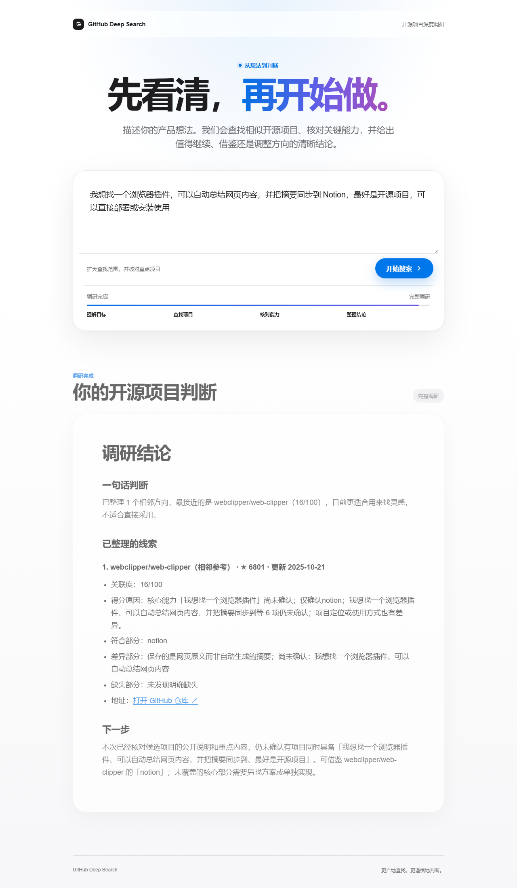
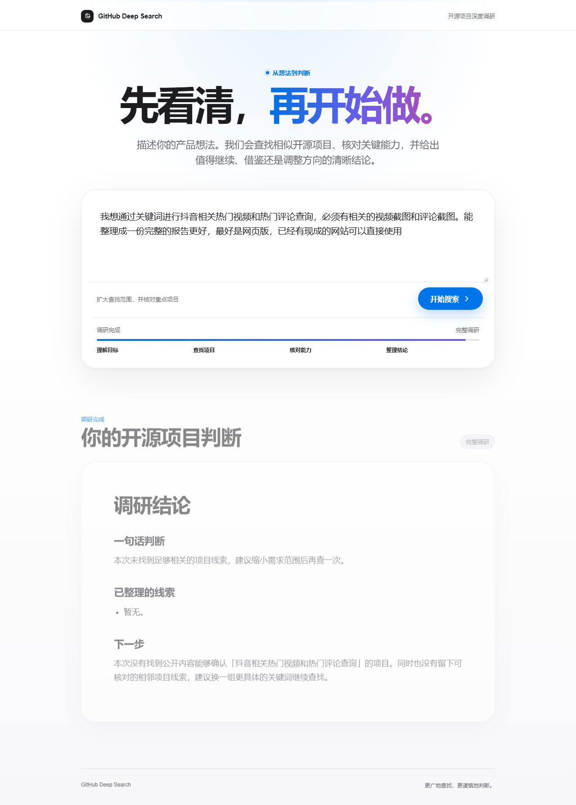

# vibecoding-qa

**针对 vibeCoding 项目的完整功能验收测试工具。**

`vibecoding-qa` 的核心目标很直接：验证一个 AI/低人工介入生成的项目，是否真的完成了用户需求，而不是只做到“代码能跑、页面能开、README 看起来完整”。

CLI 入口同时提供 `agent-test`、`vibecoding-qa` 和 `vibeqa`。本文档默认使用源码仓库里的 `node ./bin/agent-test.js`，方便 clone 后立即运行。

它会扫描项目文档、源码、报告、运行证据和用户可见输出，生成一份可以直接交给开发者或修复 agent 的 Markdown QA 报告，报告包含测试目标、复现路径、实际结果、期望结果、证据和修复优先级。

## 核心卖点

- **需求优先**：默认以 README、需求文档、交付报告、示例输入输出作为验收标准。
- **针对 vibeCoding 高频问题**：重点发现假完成、空壳功能、空报告、弱推荐、固定样例过拟合、入口不可运行、用户可见输出不可用。
- **完整功能流意识**：静态扫描不足以判定完成；报告会明确标记 full flow 是 `PASS`、`PARTIAL`、`UNVERIFIED` 还是 `FAIL`。
- **证据链交付**：每个结论都尽量关联文件、命令输出、浏览器截图、runtime artifact 或可消费链接复核结果。
- **成本透明**：测试前输出 token/API 成本预估，报告中记录真实消耗。当前 `basic` 模式不调用 LLM，不需要 API key，token 和成本均为 0。
- **一行命令可用**：clone 后可以直接从根目录测试本地目录或 GitHub URL。

## 一行开始测试

安装依赖：

```bash
npm install
```

测试当前目录：

```bash
node ./bin/agent-test.js scan . --out reports/latest
```

测试任意本地项目：

```bash
node ./bin/agent-test.js scan D:\code\some-vibecoding-project --out reports/some-project
```

测试 GitHub 仓库 URL：

```bash
node ./bin/agent-test.js scan https://github.com/user/repo --out reports/repo
```

兼容显式参数写法：

```bash
node ./bin/agent-test.js scan --target . --out reports/latest
```

生成结果：

```text
reports/latest/
├── AGENT_TEST_QA_REPORT.md
└── report.json
```

## API Key 与 Token 成本

当前默认 `basic` 模式：

- 不需要 `OPENAI_API_KEY`
- 不需要 GitHub/Tavily/LLM API key
- 不调用 LLM
- 不消耗 token
- 预估成本：`$0`
- 实际记录成本：`$0`

运行前 CLI 会打印：

```text
Preflight token/cost estimate:
  API key required: no
  Required API keys: none
  LLM mode: no-llm
  Estimated tokens: input=0, output=0, total=0
  Estimated cost: $0 (max configured: $0)
```

报告中也会写入：

```text
API Key And Token Cost
- API key required: no
- Preflight token estimate: input=0, output=0, total=0
- Actual token usage: input=0, output=0, total=0
- Actual recorded cost: $0
```

如果未来加入 LLM/外部 API 增强模式，该模式必须先实现测试前 token/cost 估算、key 声明、预算上限和测试后真实消耗记录；否则不允许静默执行。

## 如何做完整功能测试

`scan` 本身是静态扫描加证据汇总。要让报告判断完整用户流程，需要先记录 runtime 证据。

示例：记录目标项目的 CLI help：

```bash
node ./bin/agent-test.js run --target D:\code\some-project --out reports/some-project --name cli-help -- python main.py --help
```

示例：记录一个真实用户场景：

```bash
node ./bin/agent-test.js run --target D:\code\some-project --out reports/some-project --name scenario-01-main-flow -- python main.py "用户真实需求"
```

然后汇总生成 QA 报告：

```bash
node ./bin/agent-test.js scan D:\code\some-project --out reports/some-project
```

如果没有 `scenario-01-*` 这类代表性用户流程证据，报告会明确标记 full flow 为 `UNVERIFIED` 或 `PARTIAL`，不会把静态扫描误报成完整验收通过。

## 高星真实仓库样例：browser-use

为了证明这不是只服务小 demo 的工具，我们用 `vibecoding-qa` 对一个真实高星仓库跑了公开预检样例：

```bash
node ./bin/agent-test.js scan https://github.com/browser-use/browser-use --out reports/showcase/browser-use --max-files 800
```

本次运行不需要 API key，不调用 LLM，token 和成本均为 0。

精选报告摘要：

```text
Target: https://github.com/browser-use/browser-use
Mode: basic
Result: FAIL
Checks passed: 9/11
Checks failed: 2/11
Failed gates: no-obvious-secrets, no-obvious-fixture-overfit
Functional defects: 0
Runtime scenario findings: 0
Full functional flow status: not-run
API key required: no
Preflight token estimate: input=0, output=0, total=0
Actual token usage: input=0, output=0, total=0
Actual recorded cost: $0
```

这段结果的重点不是“批评某个知名项目”，而是展示 `vibecoding-qa` 的报告边界足够清楚：

- 它能对 GitHub URL 一行 clone 后扫描。
- 它会把 secret-like pattern 和 fixture/document phrase overfit 标成 obvious-risk，要求人工复核。
- 它没有发现功能性 smoke defect，就不会捏造功能缺陷。
- 它没有跑完整用户流，就明确标记 `Full functional flow status: not-run`，不会把静态扫描包装成完整验收。
- 它在报告里记录测试前预估和执行后真实 token/cost，当前均为 0。

完整报告：

- [docs/showcase/browser-use-agent-test-report.md](./docs/showcase/browser-use-agent-test-report.md)

## 被测样例：github-deepSearch

下面的截图不是为了宣传 `github-deepSearch`，而是展示 `vibecoding-qa` 如何审视一个典型 vibeCoding 项目：它会把 Web UI 运行截图、用户场景输出、候选项目质量、失败/弱结果和最终 QA 报告组织成可复核证据。

### 用户可见输出截图


### 候选结果与轻量报告


### 抖音相关需求的无扫码调研样例


完整 QA handoff 报告：

[docs/showcase/github-deepsearch-agent-test-report.md](./docs/showcase/github-deepsearch-agent-test-report.md)

<details>
<summary>更多样例截图</summary>





</details>

## 报告会判断什么

`AGENT_TEST_QA_REPORT.md` 会重点回答：

- 被测项目承诺了什么用户价值？
- 有没有代表性完整用户流程证据？
- 用户最终看到的输出是否有用？
- 输出是否只是空白、弱推荐、模板内容或不可复核结论？
- 报告/推荐/链接/文件是否能被消费和验证？
- 是否存在明显 secret、fixture overfit、硬编码演示、入口不可运行等交付风险？
- 下一步应该优先修什么？

## 当前能力边界

当前 MVP `basic` 模式：

- 支持本地目录扫描
- 支持 public GitHub URL clone 后静态扫描
- 支持读取并汇总 `agent-test run` 记录的 runtime artifacts
- 支持输出单份 Markdown QA 报告和 JSON 报告
- 不自动安装被测项目依赖
- 不默认执行被测项目代码
- 不调用 LLM 或付费外部 API

这意味着：`vibecoding-qa` 默认是安全、低成本、可复现的预检工具；完整功能验收需要你把真实用户流程通过 `agent-test run` 或浏览器/API probe 记录为证据后再扫描。

## 常用命令

```bash
npm test
npm run selftest:ux
npm run scan:self
npm run verify
```

浏览器 probe：

```bash
npm run setup:browser
npm run probe:browser
```

## 项目原则

- 不为单个仓库写项目特定补丁。
- 不把一次事故写成一次性规则；必须抽象成可复用的问题家族。
- 不在生产逻辑中硬编码仓库名、prompt、域名、用户请求或 fixture 输出。
- Runtime scenario finding 与 deterministic check gate 分开统计。
- 没有代表性完整用户流程证据时，不能把项目判定为功能验收完成。
- 如果完整流程被环境、凭证、浏览器、数据库、登录状态等阻塞，报告必须写明 `UNVERIFIED` 或 `PARTIAL`，并说明如何解除阻塞后重跑。

## 文档

- [VIBECODING_QA_STANDARD.md](./VIBECODING_QA_STANDARD.md)：通用 vibeCoding 项目测试验收标准。
- [TEST_PROJECT_DIRECTION.md](./TEST_PROJECT_DIRECTION.md)：项目方向、能力、成本、安全边界、架构和阶段规划。
- [docs/CONFIGURATION.md](./docs/CONFIGURATION.md)：配置说明。
- [docs/REPORT_SCHEMA.md](./docs/REPORT_SCHEMA.md)：报告结构和状态模型。
- [docs/TESTING_PRINCIPLES.md](./docs/TESTING_PRINCIPLES.md)：测试判断准则。
- [docs/WORKFLOW_IMPROVEMENTS.md](./docs/WORKFLOW_IMPROVEMENTS.md)：测试反馈如何沉淀为工作流改进。

## License

MIT
