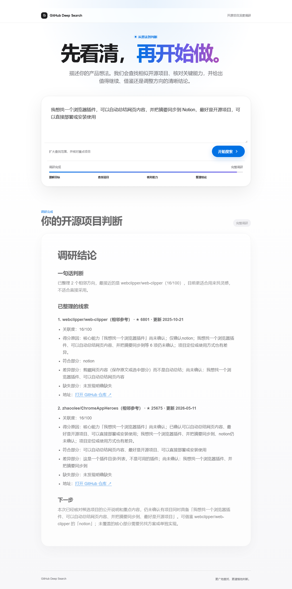
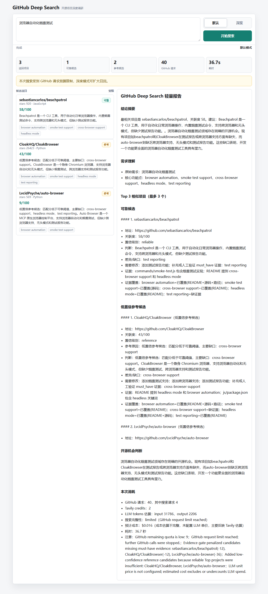
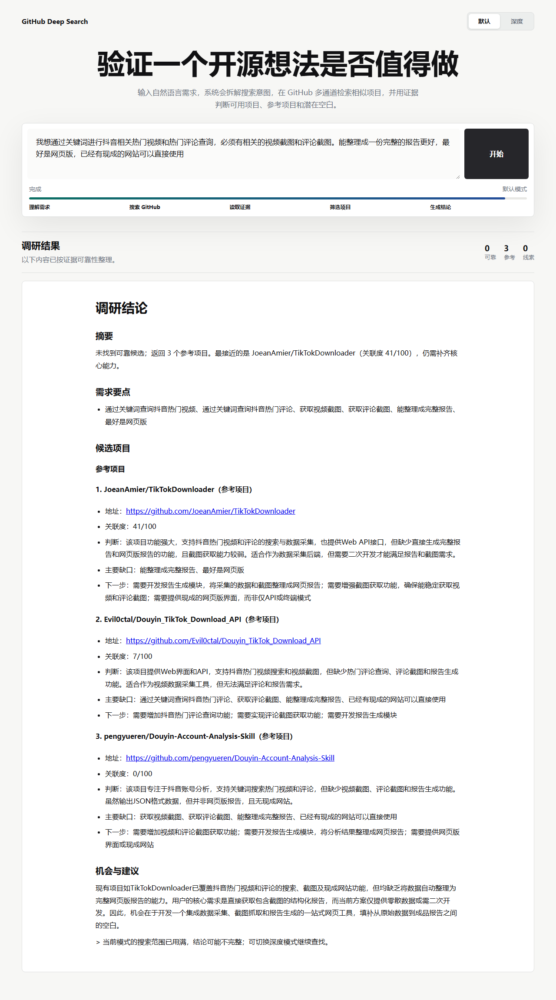

# vibecoding-qa

**一行命令，为 vibe-coded / AI-generated 项目生成可复核的功能验收 QA 产物。**

[](https://github.com/wp-i/vibecoding-qa/actions)
[](./LICENSE)
[](https://nodejs.org/)
[](#api-key--token-成本)

AI 写出来的项目，真的完成需求了吗？`vibecoding-qa` 读取项目文档、源码、运行证据和用户可见输出，生成三类产物：

- `AGENT_TEST_QA_REPORT.md`：给开发人员和修复 agent 的完整验收报告。
- `USER_QA_SUMMARY.md`：给非技术读者看的精简决策报告。
- `report.json`：给自动化、CI 和历史对比使用的机器报告。

| 你关心的事 | 当前答案 |
| --- | --- |
| 能不能直接试？ | 可以，clone 后一行命令扫本地目录或 GitHub URL |
| 要不要 API key？ | 需要，`scan` 必须配置 LLM API key |
| 会不会烧 token？ | 会，运行前打印 token/cost 预估，报告里记录真实或估算消耗 |
| 主要测什么？ | 功能是否符合需求、完整用户流是否执行、用户最终输出是否有用、是否存在明显交付风险 |
| 报告给谁看？ | 开发/agent 看完整报告，业务/产品看用户简版报告 |

## 30 秒上手

PowerShell:

```powershell
npm install
$env:AGENT_TEST_LLM_API_KEY="your_openai_compatible_key"
node ./bin/agent-test.js scan . --out reports/latest
```

扫 GitHub 仓库：

```powershell
node ./bin/agent-test.js scan https://github.com/user/repo --out reports/repo
```

输出：

```text
reports/latest/
├── AGENT_TEST_QA_REPORT.md
├── USER_QA_SUMMARY.md
└── report.json
```

## 报告分工

| 文件 | 读者 | 用途 |
| --- | --- | --- |
| `AGENT_TEST_QA_REPORT.md` | 开发人员、测试 agent、修复 agent | 复现命令、证据、缺陷、风险、验收标准和修复交接 |
| `USER_QA_SUMMARY.md` | 产品、业务经理、非技术决策者 | 用更少技术语言说明能不能发布、测了什么、主要风险和下一步 |
| `report.json` | 自动化系统、CI、历史对比 | 结构化记录项目元数据、检查结果、runtime artifacts 和 token usage |

以后项目产出默认都应保留这两份 Markdown 报告：一份面向开发/agent，一份面向纯用户。

## 它重点检查什么

`vibecoding-qa` 的默认判断权重是需求和用户价值优先，而不是代码审美优先。

- 是否从 README/docs/汇总 Markdown 中识别出核心承诺。
- 是否有代表性的端到端用户流程证据。
- 用户最终看到的报告、推荐、搜索结果或生成物是否有价值。
- 空结果、弱推荐、低分相邻参考是否被正确标注，而不是包装成可直接采用。
- Web UI 是否能打开、输入、点击、等待结果，并且没有明显阻塞主流程的问题。
- 返回的链接、仓库、文件或报告是否能被轻量消费复核。
- 是否存在明显 key 泄露、固定样例过拟合、入口不可运行等交付风险。
- API key、token 预估和实际消耗是否披露。

## 完整功能流怎么测

`scan` 会读取项目证据、调用 LLM 生成项目专属验收契约，再汇总静态检查和已记录的 runtime artifacts。要让报告判断完整用户流程，需要先记录代表性场景：

```powershell
node ./bin/agent-test.js run --target D:\code\some-project --out reports/some-project --name scenario-01-main-flow -- python main.py "用户真实需求"
node ./bin/agent-test.js scan D:\code\some-project --out reports/some-project
```

建议完整验收至少记录 3 个差异明显的 `scenario-*` artifact。只跑静态扫描、编译、help 命令或窄 smoke test 时，报告会标记 `UNVERIFIED` 或 `PARTIAL`，不会把辅助证据包装成完整验收。

## API Key / Token 成本

`agent-test` 只有一种验收路径：LLM-required acceptance。API key 用于读取项目证据并生成项目专属验收契约，不是可选增强项。

PowerShell:

```powershell
$env:AGENT_TEST_LLM_API_KEY="your_openai_compatible_key"
$env:AGENT_TEST_LLM_MODEL="gpt-5-mini"
$env:AGENT_TEST_LLM_BASE_URL="https://api.openai.com/v1"
```

Preflight 会在执行前显示类似信息：

```text
API key required: yes
Required API keys: AGENT_TEST_LLM_API_KEY, OPENAI_API_KEY
LLM mode: required
Estimated tokens: input=30000, output=6000, total=36000
Estimated cost: $0 (max configured: $5)
```

`llm.inputUsdPer1M` 和 `llm.outputUsdPer1M` 未配置时，报告会明确说明美元估算不完整；不会把不完整估算伪装成真实成本。`llm.maxCostUsd` 用于预执行阶段的成本上限，如果已配置单价且预估超预算，`scan` 会直接失败。

## UI 和浏览器检查

对 Web UI、Dashboard、管理台、浏览器插件 UI、桌面/移动 UI 等项目，`agent-test` 会让 LLM 从目标项目文档中生成 UI/browser 验收规则。

这些规则只检查用户主流程是否被明显阻塞，例如：

- 主要输入、按钮、导航和结果区域是否可见可操作。
- 文本、按钮、面板、弹窗或固定栏是否明显重叠、截断或遮挡主流程。
- 长报告、表格、侧栏和弹窗是否能在正确容器内滚动。
- 完成流程后是否能看到成功、错误或结果状态。

颜色、圆角、审美偏好不属于默认验收范围，除非目标项目文档把它们写成功能要求，或它们直接阻塞用户完成流程。

## 当前边界

| 能力 | 状态 |
| --- | --- |
| 本地目录扫描 | supported |
| GitHub URL clone 后静态扫描 | supported |
| LLM 生成项目专属验收契约 | required |
| runtime artifacts 汇总 | supported |
| 开发/agent Markdown 报告 | supported |
| 纯用户 Markdown 摘要 | supported |
| JSON 机器报告 | supported |
| 自动安装被测项目依赖 | no |
| 默认执行被测项目代码 | no，需要先用 `agent-test run` 记录 |

## 常用命令

```powershell
npm test
npm run verify
npm run setup:browser
npm run probe:browser
```

## 样例

历史 showcase 展示了 `vibecoding-qa` 如何组织用户可见输出、运行证据和 QA 报告：

- [browser-use QA 报告](./docs/showcase/browser-use-agent-test-report.md)
- [github-deepSearch QA 报告](./docs/showcase/github-deepsearch-agent-test-report.md)

<details>
<summary>展开查看 github-deepSearch 截图</summary>







</details>

## 文档

- [VIBECODING_QA_STANDARD.md](./VIBECODING_QA_STANDARD.md)
- [TEST_PROJECT_DIRECTION.md](./TEST_PROJECT_DIRECTION.md)
- [docs/CONFIGURATION.md](./docs/CONFIGURATION.md)
- [docs/REPORT_SCHEMA.md](./docs/REPORT_SCHEMA.md)
- [docs/TESTING_PRINCIPLES.md](./docs/TESTING_PRINCIPLES.md)
- [docs/WORKFLOW_IMPROVEMENTS.md](./docs/WORKFLOW_IMPROVEMENTS.md)

## License

MIT
